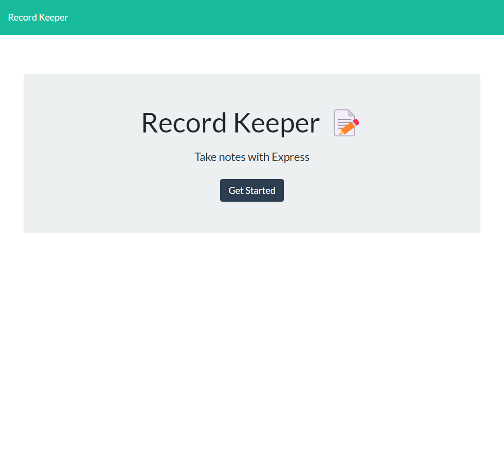

# Record Keeper

## Table of contents

- [Overview](#overview)
  - [The challenge](#the-challenge)
  - [User Story](#user-story)
  - [Acceptance Criteria](#acceptance-criteria)
  - [Screenshot](#screenshot)
  - [Links](#links)
- [My process](#my-process)
  - [Built with](#built-with)
  - [What I learned](#what-i-learned)
  - [Continued development](#continued-development)
- [Author](#author)

## Overview

### The challenge

Your assignment is to modify starter code to create an application called Note Taker that can be used to write and save notes. This application will use an Express.js back end and will save and retrieve note data from a JSON file.

The application’s front end has already been created. It's your job to build the back end, connect the two, and then deploy the entire application to Heroku.

### User Story

AS A small business owner
I WANT to be able to write and save notes
SO THAT I can organize my thoughts and keep track of tasks I need to complete

### Acceptance Criteria

GIVEN a note-taking application
WHEN I open the Note Taker
THEN I am presented with a landing page with a link to a notes page
WHEN I click on the link to the notes page
THEN I am presented with a page with existing notes listed in the left-hand column, plus empty fields to enter a new note title and the note’s text in the right-hand column
WHEN I enter a new note title and the note’s text
THEN a Save icon appears in the navigation at the top of the page
WHEN I click on the Save icon
THEN the new note I have entered is saved and appears in the left-hand column with the other existing notes
WHEN I click on an existing note in the list in the left-hand column
THEN that note appears in the right-hand column
WHEN I click on the Write icon in the navigation at the top of the page
THEN I am presented with empty fields to enter a new note title and the note’s text in the right-hand column

### Screenshot

### Links

- Solution URL: [GitHub](https://github.com/Snufalufakis/record_keeper)
- Heroku Live Link: [Heroku](https://record-keeper1.herokuapp.com/)

## My process

Pulling hair.. Kidding...
Routes setup first then linking GET and POST to server.js from the api's in routes.Tinkered with the index html to make the name unique. Banged my head on index.js not playing nice with routes/server.js. But overall I got Heroku running with no errors. still working on delete/save. Something is crashing with my id setup.

### Built with

- NodeJs
- Nodemon
- Heroku
- Javascript
- ExpressJs

### What I learned

Bugs are annoying in NodeJs they dont really appear in console unless its javascript related. and Nodemon has cryptic errors that sometimes sends you into the node module. But its all a learning experience.

### Continued development

Learning more about NodeJs, and expressJs. The error's are a challenge to understand. Console logging is little help and Nodemon is a geat tool thats been helping me figure out what most of the bugs are.

## Author

- Twitter - [@SnufAlufAkis2](https://www.twitter.com/Snufalufakis2)
